# Assignment 2

## Docker basics (images, build, tagging, publish)

* To follow up this tutorial, first read [this page](https://docs.docker.com/get-started/#docker-concepts) and then [this  one](https://docs.docker.com/get-started/part2/)

## About services

In a distributed application, different pieces of the app are called “services.” For example, if you imagine a video sharing site, it probably includes a service for storing application data in a database, a service for video transcoding in the background after a user uploads something, a service for the front-end, and so on.

Services are really just “containers in production.” A service only runs one image, but it codifies the way that image runs—what ports it should use, how many replicas of the container should run so the service has the capacity it needs, and so on. Scaling a service changes the number of container instances running that piece of software, assigning more computing resources to the service in the process.

Luckily it’s very easy to define, run, and scale services with the Docker platform -- just write a `docker-compose.yml` file.

## Defining the docker-compose file

* A `docker-compose.yml` file is a YAML file that defines how Docker containers should behave in production.

* The `docker-compose.yml` file contained in this repo does the following:
  1. Pull a custom image from the registry (docker hub).

  2. Run 5 instances of that image as a service called `web`, limiting each one to use, at most, 10% of the CPU (across all cores), and 50MB of RAM.

  3. Immediately restart containers if one fails.

  4. Map port `4000` on the host to `web`’s port `80`.

  5. Instruct `web`’s containers to share port `80` via a load-balanced network called `webnet`. (Internally, the containers themselves publish to web’s port 80 at an ephemeral port.)

  6. Define the `webnet` network with the default settings (which is a load-balanced overlay network).
    * The overlay network driver creates a distributed network among multiple Docker daemon hosts. This network sits on top of (overlays) the host-specific networks, allowing containers connected to it (including swarm service containers) to communicate securely. Docker transparently handles routing of each packet to and from the correct Docker daemon host and the correct destination container.

## Running our new load-balanced app

Before we can use the `docker stack deploy` command we first run: `docker swarm init`

* Now let’s run it. You need to give your app a name. Here, it is set to getstartedlab:
  * `docker stack deploy -c docker-compose.yml getstartedlab`

  * 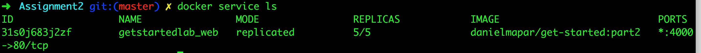

  * 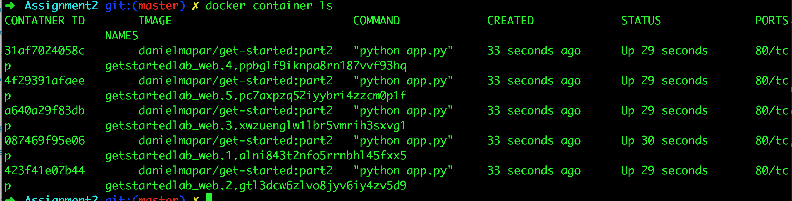

* A single container running in a service is called a `task`. Tasks are given unique IDs that numerically increment, up to the number of replicas you defined in `docker-compose.yml`. List the tasks for your service:

  * `docker service ps getstartedlab_web`

  * 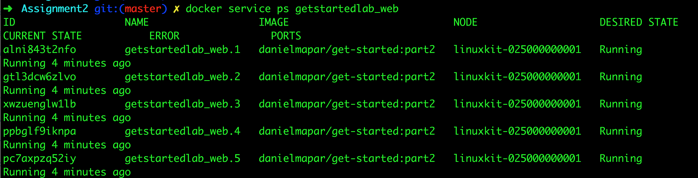

* You can run `curl -4 http://localhost:4000` several times in a row, or go to that URL in your browser and hit refresh a few times.

* Either way, the container ID changes, demonstrating the load-balancing; with each request, one of the 5 tasks is chosen, in a round-robin fashion, to respond. The container IDs match your output from the command (`docker container ls -q`).

## Scale the app

* You can scale the app by changing the replicas value in `docker-compose.yml`, saving the change, and re-running the docker stack deploy command:
  * `docker stack deploy -c docker-compose.yml getstartedlab`

  * Docker performs an in-place update, no need to tear the stack down first or kill any containers.

  * Now, re-run docker container ls -q to see the deployed instances reconfigured. If you scaled up the replicas, more tasks, and hence, more containers, are started.

## Take down the app and the swarm

* Take the app down with `docker stack rm`:
  * `docker stack rm getstartedlab`


* Take down the swarm.
  * `docker swarm leave --force`

## Understanding Swarm clusters

A swarm is a group of machines that are running Docker and joined into a cluster. After that has happened, you continue to run the Docker commands you’re used to, but now they are executed on a cluster by a swarm manager. The machines in a swarm can be physical or virtual. After joining a swarm, they are referred to as nodes.

Swarm managers can use several strategies to run containers, such as “emptiest node” -- which fills the least utilized machines with containers. Or “global”, which ensures that each machine gets exactly one instance of the specified container. You instruct the swarm manager to use these strategies in the Compose file, just like the one you have already been using.

Swarm managers are the only machines in a swarm that can execute your commands, or authorize other machines to join the swarm as workers. Workers are just there to provide capacity and do not have the authority to tell any other machine what it can and cannot do.

Up until now, you have been using Docker in a single-host mode on your local machine. But Docker also can be switched into swarm mode, and that’s what enables the use of swarms. Enabling swarm mode instantly makes the current machine a swarm manager. From then on, Docker runs the commands you execute on the swarm you’re managing, rather than just on the current machine.

## Set up your swarm

A swarm is made up of multiple nodes, which can be either physical or virtual machines. The basic concept is simple enough: run `docker swarm init` to enable swarm mode and make your current machine a swarm manager, then run `docker swarm join` on other machines to have them join the swarm as workers. Choose a tab below to see how this plays out in various contexts. We use VMs to quickly create a two-machine cluster and turn it into a swarm.

### Create a cluster

* **VMS ON YOUR LOCAL MACHINE (MAC, LINUX, WINDOWS 7 AND 8)**

  * You need a hypervisor that can create virtual machines (VMs), so [install Oracle VirtualBox](https://www.virtualbox.org/wiki/Downloads) for your machine’s OS.

* Now, create a couple of VMs using docker-machine, using the VirtualBox driver:

  * `docker-machine create --driver virtualbox myvm1`

    * To disable TLS do the following:

      * `docker-machine ssh myvm1`

      * `sudo vi /var/lib/boot2docker/profile`
      
      * Set `DOCKER_TLS=no` and `DOCKER_HOST='-H tcp://0.0.0.0:4040 -H unix:///var/run/docker.sock -H tcp://0.0.0.0:2376'`

  * `docker-machine create --driver virtualbox myvm2`


* **LIST THE VMS AND GET THEIR IP ADDRESSES**

  * You now have two VMs created, named `myvm1` and `myvm2`.

  * Use this command to list the machines and get their IP addresses.

    * `docker-machine ls`
    * 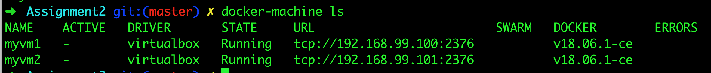


* **INITIALIZE THE SWARM AND ADD NODES**

  * The first machine acts as the manager, which executes management commands and authenticates workers to join the swarm, and the second is a worker.

  * You can send commands to your VMs using `docker-machine ssh`. Instruct `myvm1` to become a swarm manager with `docker swarm init` and look for output like this:

    * `docker-machine ssh myvm1 "docker swarm init --advertise-addr <myvm1 ip>"``

    * 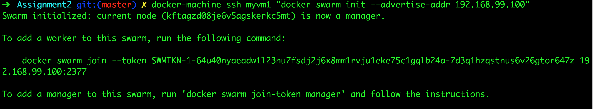

  * Always run docker swarm init and docker swarm join with port 2377 (the swarm management port), or no port at all and let it take the default.

  * The machine IP addresses returned by docker-machine ls include port 2376, which is the Docker daemon port. Do not use this port or you may experience errors.

  * As you can see, the response to docker swarm init contains a pre-configured docker swarm join command for you to run on any nodes you want to add. Copy this command, and send it to `myvm2` via `docker-machine ssh` to have `myvm2` join your new swarm as a worker:

    * `docker-machine ssh myvm2 "docker swarm join --token SWMTKN-1-64u40nyaeadw1l23nu7fsdj2j6x8mm1rvju1eke75c1gqlb24a-7d3q1hzqstnus6v26gtor647z 192.168.99.100:2377"`

    * 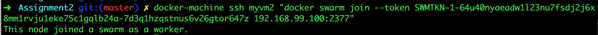

    * Congratulations, you have created your first swarm!

  * Run `docker node ls` on the manager to view the nodes in this swarm:

    * `docker-machine ssh myvm1 "docker node ls"`

    * 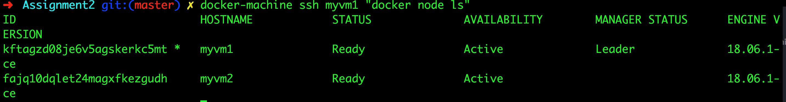

  * If you want to start over, you can run `docker swarm leave` from each node.

### Deploy your app on the swarm cluster

The hard part is over. Now you just repeat the process you used in part 3 to deploy on your new swarm. Just remember that only swarm managers like `myvm1` execute Docker commands; workers are just for capacity.

* Configure a `docker-machine` shell to the swarm manager

  * So far, you’ve been wrapping Docker commands in `docker-machine ssh` to talk to the VMs. Another option is to run `docker-machine env <machine>` to get and run a command that configures your current shell to talk to the Docker daemon on the VM. This method works better for the next step because it allows you to use your local `docker-compose.yml` file to deploy the app “remotely” without having to copy it anywhere.

  * Type `docker-machine env myvm1`, then copy-paste and run the command provided as the last line of the output to configure your shell to talk to `myvm1`, the swarm manager.

  * The commands to configure your shell differ depending on whether you are Mac, Linux, or Windows, so examples of each are shown on the tabs below.

  * Run `docker-machine env myvm1` to get the command to configure your shell to talk to `myvm1`.

  ```
      $ docker-machine env myvm1
      export DOCKER_TLS_VERIFY="1"
      export DOCKER_HOST="tcp://192.168.99.100:2376"
      export DOCKER_CERT_PATH="/Users/sam/.docker/machine/machines/myvm1"
      export DOCKER_MACHINE_NAME="myvm1"
      # Run this command to configure your shell:
      # eval $(docker-machine env myvm1)
    ```

  * Run the given command to configure your shell to talk to `myvm1`.

    * `eval $(docker-machine env myvm1)`

  * Run `docker-machine ls` to verify that `myvm1` is now the active machine, as indicated by the asterisk next to it.

    * 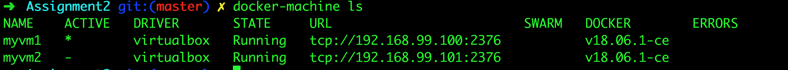


### Deploy the app on the swarm manager

* Now that you have `myvm1`, you can use its powers as a swarm manager to deploy your app by using the same `docker stack deploy` command we used before to `myvm1`, and your local copy of `docker-compose.yml`. This command may take a few seconds to complete and the deployment takes some time to be available. Use the `docker service ps <service_name>` command on a swarm manager to verify that all services have been redeployed.

* You are connected to `myvm1` by means of the `docker-machine` shell configuration, and you still have access to the files on your local host. Make sure you are in the same directory as before, which includes the `docker-compose.yml`.

* Just like before, run the following command to deploy the app on `myvm1`.

  * `docker stack deploy -c docker-compose.yml getstartedlab`

  * `docker service ps getstartedlab_web`

  * 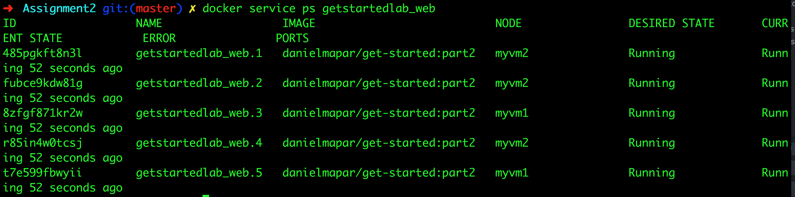

    * Only this time notice that the services (and associated containers) have been distributed between both `myvm1` and `myvm2`.


* And that’s it, the app is deployed on a swarm cluster!

## Accessing your cluster

* You can access your app from the IP address of either `myvm1` or `myvm2`.

* The network you created is shared between them and load-balancing. Run `docker-machine ls` to get your VMs’ IP addresses and visit either of them on a browser, hitting refresh (or just curl them).

* 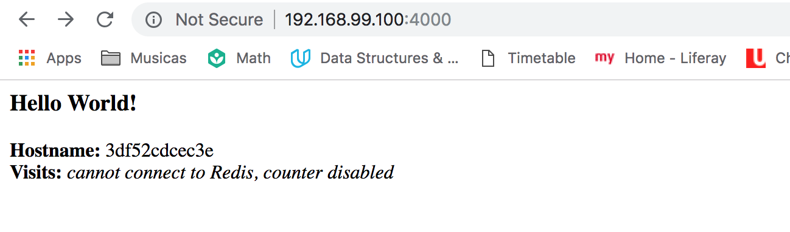

* There are five possible container IDs all cycling by randomly, demonstrating the load-balancing.

* The reason both IP addresses work is that nodes in a swarm participate in an ingress **routing mesh**. This ensures that a service deployed at a certain port within your swarm always has that port reserved to itself, no matter what node is actually running the container. Here’s a diagram of how a routing mesh for a service called `my-web` published at port `8080` on a three-node swarm would look:

  * 


### Iterating and scaling your app

* Scale the app by changing the `docker-compose.yml` file.

* Change the app behavior by editing code, then rebuild, and push the new image. (To do this, follow the same steps you took earlier to build the app and publish the image).

* In either case, simply run `docker stack deploy` again to deploy these changes.

* You can join any machine, physical or virtual, to this swarm, using the same `docker swarm join` command you used on `myvm2`, and capacity is added to your cluster. Just run `docker stack deploy` afterwards, and your app can take advantage of the new resources.

### Cleanup and reboot

* Stacks and swarms

* You can tear down the stack with `docker stack rm`. For example:

  * `docker stack rm getstartedlab`

  * At some point later, you can remove this swarm if you want to with `docker-machine ssh myvm2 "docker swarm leave"` on the worker and `docker-machine ssh myvm1 "docker swarm leave --force"` on the manager.

### Unsetting docker-machine shell variable settings

* You can unset the `docker-machine` environment variables in your current shell with the given command.

  * `eval $(docker-machine env -u)`

  * 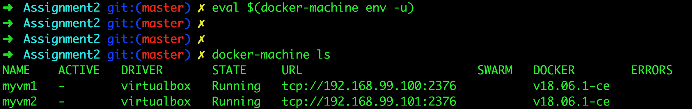

  * This disconnects the shell from `docker-machine` created virtual machines, and allows you to continue working in the same shell, now using native docker commands (for example, on Docker for Mac or Docker for Windows).

### Restarting Docker machines

* If you shut down your local host, Docker machines stops running. You can check the status of machines by running `docker-machine ls`.

* To restart a machine that’s stopped, run:

  * `docker-machine start <machine-name>`

  ```
      $ docker-machine start myvm1
      Starting "myvm1"...
      (myvm1) Check network to re-create if needed...
      (myvm1) Waiting for an IP...
      Machine "myvm1" was started.
      Waiting for SSH to be available...
      Detecting the provisioner...
      Started machines may have new IP addresses. You may need to re-run the `docker-machine env` command.

      $ docker-machine start myvm2
      Starting "myvm2"...
      (myvm2) Check network to re-create if needed...
      (myvm2) Waiting for an IP...
      Machine "myvm2" was started.
      Waiting for SSH to be available...
      Detecting the provisioner...
      Started machines may have new IP addresses. You may need to re-run the `docker-machine env` command.
    ```


## Stack

* A stack is a group of interrelated services that share dependencies, and can be orchestrated and scaled together. A single stack is capable of defining and coordinating the functionality of an entire application (though very complex applications may want to use multiple stacks).

  * Note: Docker stack is ignoring “build” instructions. You can’t build new images using the stack commands. It need pre-built images to exist. So `docker-compose` is better suited for development scenarios.

  * Both `docker-compose` and the new `docker stack` commands can be used with `docker-compose.yml` files which are written according to the specification of version 3. For your version 2 reliant projects, you’ll have to continue using docker-compose. If you want to upgrade, it’s not a lot of work though.

### Add a new service and redeploy

* It’s easy to add services to our `docker-compose.yml` file. First, let’s add a free visualizer service that lets us look at how our swarm is scheduling containers.

  * Open the `docker-compose.yml` and check the `visualizer` service

* The only thing new here is the peer service to `web`, named `visualizer`. Notice two new things here: a `volumes` key, giving the `visualizer` access to the host’s socket file for Docker, and a placement key, ensuring that this service only ever runs on a `swarm manager` -- never a `worker`. That’s because this container, built from an open source project created by Docker, displays Docker services running on a swarm in a diagram.

* Make sure your shell is configured to talk to `myvm1`

  * `docker-machine env myvm1`

  * `eval $(docker-machine env myvm1)`

* Re-run the `docker stack deploy` command on the manager, and whatever services need updating are updated:

  * `docker stack deploy -c docker-compose.yml getstartedlab`

* Take a look at the visualizer.

  * You saw in the Compose file that `visualizer` runs on port 8080. Get the IP address of one of your nodes by running `docker-machine ls`. Go to either IP address at port 8080 and you can see the visualizer running:

  * 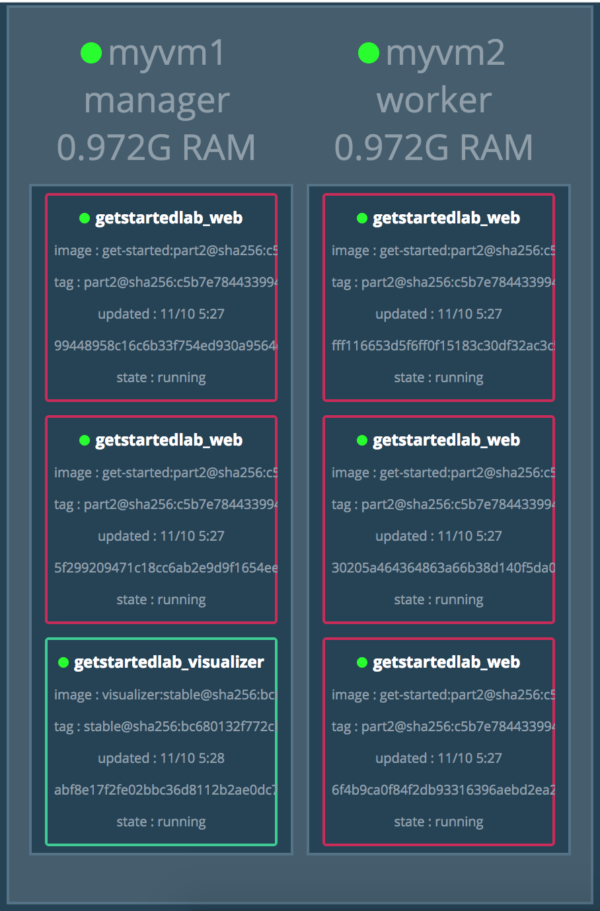

* The single copy of `visualizer` is running on the manager as you expect, and the 5 instances of `web` are spread out across the swarm. You can corroborate this visualization by running `docker stack ps <stack>`:

  * `docker stack ps getstartedlab`

  * 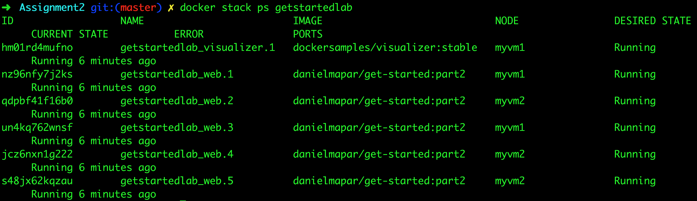

  * The visualizer is a standalone service that can run in any app that includes it in the stack. It doesn’t depend on anything else. Now let’s create a service that does have a dependency: the Redis service that provides a visitor counter.


### Persist the data

* Let’s go through the same workflow once more to add a Redis database for storing app data.

  * Open the `docker-compose.yml` and check the `redis` service

* Redis has an official `image` in the Docker library and has been granted the short image name of just `redis`, so no username/repo notation here. The Redis port, 6379, has been pre-configured by Redis to be exposed from the container to the host, and here in our Compose file we expose it from the host to the world, so you can actually enter the IP for any of your nodes into Redis Desktop Manager and manage this Redis instance, if you so choose.

* Most importantly, there are a couple of things in the `redis` specification that make data persist between deployments of this stack:

  * `redis` always runs on the manager, so it’s always using the same filesystem.

  * `redis` accesses an arbitrary directory in the host’s file system as `/data` inside the container, which is where Redis stores data.

* Together, this is creating a “source of truth” in your host’s physical filesystem for the Redis data. Without this, Redis would store its data in `/data` inside the container’s filesystem, which would get wiped out if that container were ever redeployed.

* This source of truth has two components:

  * The placement constraint you put on the Redis service, ensuring that it always uses the same host.

  * The volume you created that lets the container access `./data` (on the host) as `/data` (inside the Redis container). While containers come and go, the files stored on `./data` on the specified host persists, enabling continuity.

* You are ready to deploy your new Redis-using stack.

* Create a `./data` directory on the manager:

  * `docker-machine ssh myvm1 "mkdir ./data"`

* Make sure your shell is configured to talk to `myvm1`

* Run `docker stack deploy` one more time.

* Run `docker service ls` to verify that the three services are running as expected.

  * 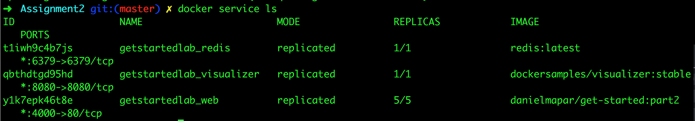

* Check the web page at one of your nodes, such as http://192.168.99.100:4000, and take a look at the results of the visitor counter, which is now live and storing information on Redis.

* 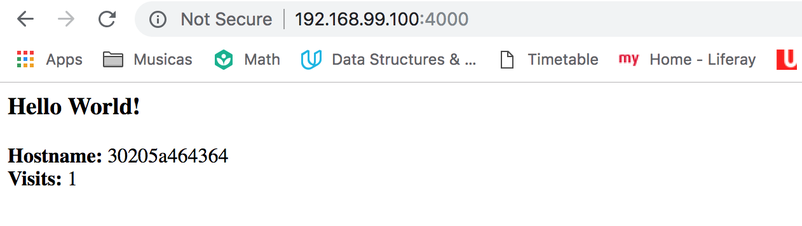

* 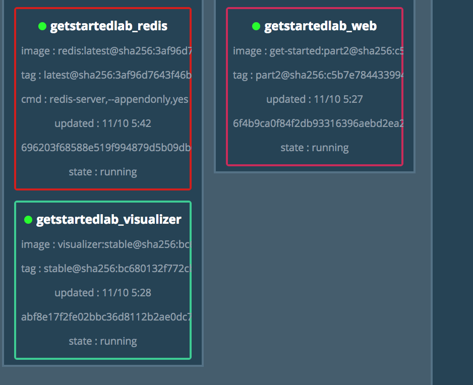

## Connect Docker Cloud

* To deploy your swarm follow [this instructions](https://docs.docker.com/get-started/part6/#connect-docker-cloud)

## Using Docker API

* You can use the [Docker SDK](https://docs.docker.com/develop/sdk/) to communicate with your containers

* In case you want to access the RESTful API directly, you can enable it to be tunnelled to an specific port
  * Check [this tutorial](https://success.docker.com/article/how-do-i-enable-the-remote-api-for-dockerd) for more
